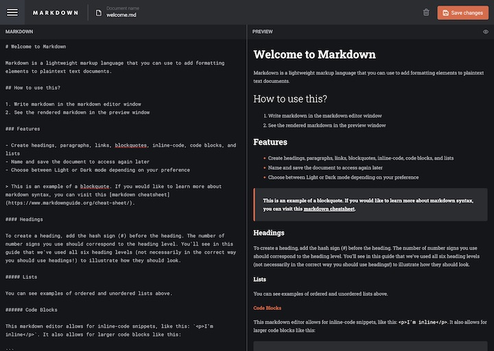

# Frontend Mentor - In-browser markdown editor solution

This is a solution to the [In-browser markdown editor challenge on Frontend Mentor](https://www.frontendmentor.io/challenges/inbrowser-markdown-editor-r16TrrQX9). Frontend Mentor challenges help you improve your coding skills by building realistic projects. 

## Table of contents

- [Overview](#overview)
  - [The challenge](#the-challenge)
  - [Screenshot](#screenshot)
  - [Links](#links)
- [My process](#my-process)
  - [Built with](#built-with)
  - [What I learned](#what-i-learned)
  - [Useful resources](#useful-resources)
- [Author](#author)

## Overview

### The challenge

Users should be able to:

- Create, Read, Update, and Delete markdown documents
- Name and save documents to be accessed as needed
- Edit the markdown of a document and see the formatted preview of the content
- View a full-page preview of the formatted content
- View the optimal layout for the app depending on their device's screen size
- See hover states for all interactive elements on the page
- **Bonus**: If you're building a purely front-end project, use localStorage to save the current state in the browser that persists when the browser is refreshed
- **Bonus**: Build this project as a full-stack application

### Screenshot

### Links

- Solution URL: [https://github.com/webdevbynight/in-browser-markdown-editor](https://github.com/webdevbynight/in-browser-markdown-editor)
- Live Site URL: [https://webdevbynight.github.io/in-browser-markdown-editor/](https://webdevbynight.github.io/in-browser-markdown-editor/)

## My process

### Built with

- Semantic HTML5 markup
- CSS (via SCSS)
  - custom properties
  - logical properties
  - flexbox
  - grid
- JavaScript (via TypeScript)
  - localStorage
  - fetch
- Mobile-first workflow

### What I learned

I learnt the `::backdrop` pseudo-element to add a background to a modal `dialog` element.

To display the markdown editor, I first used the `textarea` element, but I wanted to expand it all over the available height. The easiest way to do it is to use the `field-sizing: content` CSS declaration; but, the `field-sizing` property is not supported by Firefox and Safari (Firefox 131- and Safari 18- at the time when I wrote these lines). So, instead of `textarea`, I used a `div` with the `contenteditable` attribute set to `"true"`.

### Useful resources

- [Dialog (Modal) pattern](https://www.w3.org/WAI/ARIA/apg/patterns/dialog-modal/) - This helped me to add the appropriate ARIA properties and states to the modal `dialog` element.
- [Alert and Message Dialogs pattern](https://www.w3.org/WAI/ARIA/apg/patterns/alertdialog/) - This helped me to add the appropriate ARIA role and properties to mark up the modal `dialog` element as an alert dialog.
- [It is possible to expand a textarea only with CSS?](https://stackoverflow.com/questions/15865982/it-is-possible-to-expand-a-textarea-only-with-css#answer-78764792) - Despite the age of this topic on Stack Overflow, there I found the answer to my wonderings about `textarea` expansion with just CSS.

## Author

- Website - [Victor Brito](https://victor-brito.dev)
- Frontend Mentor - [@webdevbynight](https://www.frontendmentor.io/profile/webdevbynight)
- Mastodon - [@webdevbynight](https://mastodon.social/webdevbynight)
